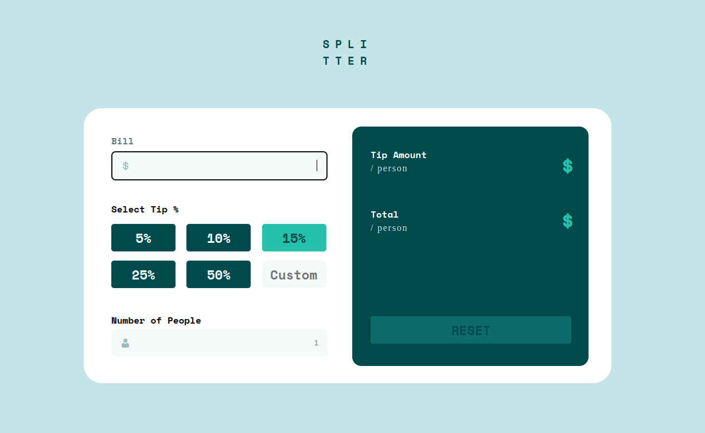
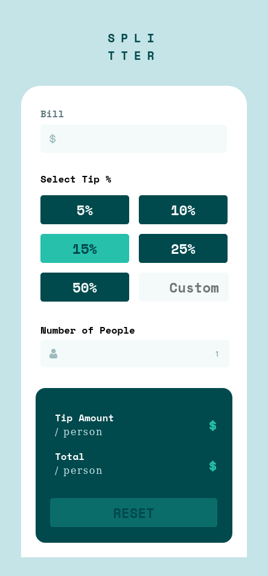

# Frontend Mentor - Tip calculator app
This a Frontend Mentor Challenge on a Tip calculator Web app build in HTML,CSS(SASS) and JS. The design and images are provided by Frontend Mentor.

[Live Preview of raw HTML from this Github, hosted on raw.githack.com ](https://raw.githack.com/gurpreet2188/frontend-mentor-tip-calc/master/index.html)

